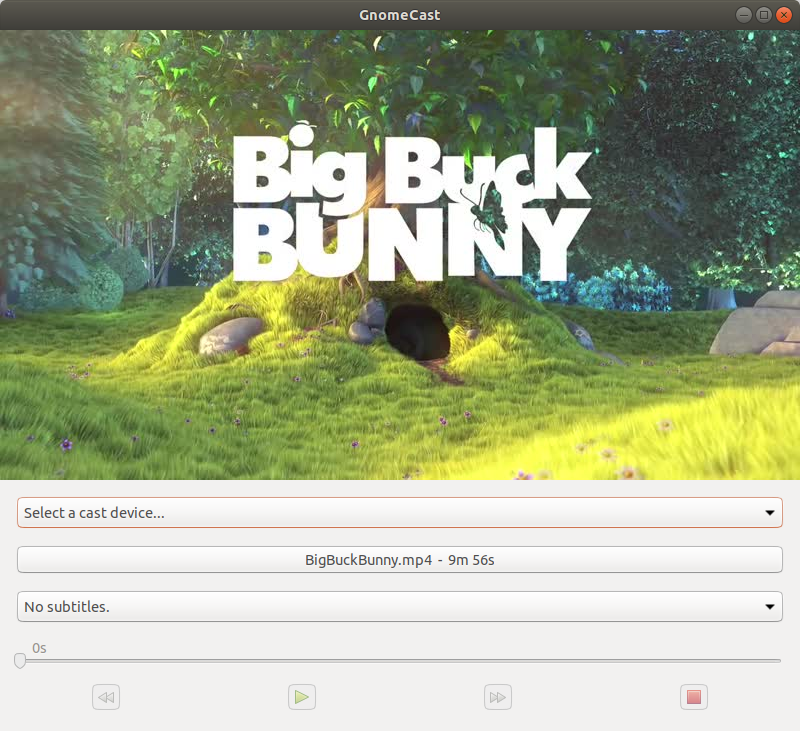

GnomeCast
=========

This is a native Linux GUI for casting local files to ChromeCast devices.  It supports:

- Realtime transcoding (only when needed)
- Subtitles (embedded and external SRT files)
- Fast scrubbing (waiting 20s for buffering to skip 30s ahead is wrong!)

Install
-------
Please run:

```
pip3 install gnomecast
```

If installing in a `mkvirtualenv`, make sure you include the `--system-site-packages` parameter to get the GTK bindings.

Run
---

```
python3 -m gnomecast
```

If you see:
```python
AttributeError: module 'html5lib.treebuilders' has no attribute '_base'
```

This is a known bug in `html5lib` (used by `pycaptions`).  Run this to fix it:
```
# pip3 install --upgrade html5lib==1.0b8
```

*Please report bugs!*


Thanks To...
------------

- https://github.com/balloob/pychromecast
- https://github.com/pbs/pycaption
- https://www.ffmpeg.org/

Transcoding
-----------
Chromecasts only support a handful of media formats.  See: https://developers.google.com/cast/docs/media

So some amount of transcoding is necessary if your video files don't conform.  But we're smart about it.  If you have an `.mkv` file with `h264` video and `AAC` audio, we use `ffmpeg` to simply rewrite the container (to `.mp4`) without touching the underlying streams, which my XPS 13 can at around 100x realtime (it's fully IO bound).

Now if you have that same `.mkv` file with and `A3C` audio stream (which Chromecast doesn't support) we'll rewrite the container, copy the `h264` stream as is and only transcode the audio (at about 20x).

If neither your file's audio or video streams are supported, then it'll do a full transcode (at around 5x).

We write the entire transcoded file to your `/tmp` directory in order to make scrubbing fast and glitch-free, a good trade-off IMO.  Hopefully you're not running your drive at less than one video's worth of free space!

Subtitles
---------
Chromecast only supports a handful of subtitle formats, `.srt` not included.  But it does support [WebVTT](https://w3c.github.io/webvtt/).  So we extract whatever subtitles are in your video, convert them to WebVTT, and then reattach them to the video through Chomecast's API.
